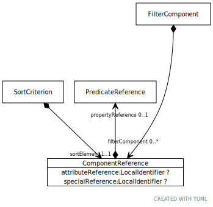

# Type: ComponentReference

A reference to a CTS2 model element. ComponentReference may reference a model attribute, a Property, or a special
element such as match strength.

URI: [https://hotecosystem.org/tccm/filtersandsorting/ComponentReference](https://hotecosystem.org/tccm/filtersandsorting/ComponentReference)

## Referenced by class

 *  **[FilterComponent](FilterComponent.md)** *[FilterComponent➞filterComponent](FilterComponent_filterComponent.md)*  0..*  **[ComponentReference](ComponentReference.md)**
 *  **[SortCriterion](SortCriterion.md)** *[SortCriterion➞sortElement](SortCriterion_sortElement.md)*  REQ  **[ComponentReference](ComponentReference.md)**
 *  **None** *[filterComponent](filterComponent.md)*  0..*  **[ComponentReference](ComponentReference.md)**
 *  **None** *[sortElement](sortElement.md)*  REQ  **[ComponentReference](ComponentReference.md)**

## Attributes

### Own

 * [ComponentReference➞attributeReference](ComponentReference_attributeReference.md)  OPT
    * range: [LocalIdentifier](types/LocalIdentifier.md)
 * [ComponentReference➞propertyReference](ComponentReference_propertyReference.md)  OPT
    * range: [PredicateReference](PredicateReference.md)
 * [ComponentReference➞specialReference](ComponentReference_specialReference.md)  OPT
    * range: [LocalIdentifier](types/LocalIdentifier.md)
