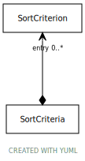

# Type: SortCriteria

An ordered list of sort criterion. The first entry in the list identifies the primary sort order, the second
entry the sub sort order, etc.

URI: [https://hotecosystem.org/tccm/filtersandsorting/SortCriteria](https://hotecosystem.org/tccm/filtersandsorting/SortCriteria)

## Referenced by class

## Attributes

### Own

 * [SortCriteria➞entry](SortCriteria_entry.md)  0..*
    * Description: a rule for sorting
    * range: [SortCriterion](SortCriterion.md)
