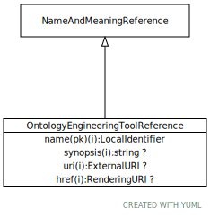

# Type: OntologyEngineeringToolReference

A reference to a tool that can be used to create an ontology.

URI: [https://hotecosystem.org/tccm/sorting/OntologyEngineeringToolReference](https://hotecosystem.org/tccm/sorting/OntologyEngineeringToolReference)

## Parents

 *  is_a: [NameAndMeaningReference](NameAndMeaningReference.md) - A NameAndMeaningReference consists of a local identifier that references a unique meaning within the context of

## Attributes

### Inherited from NameAndMeaningReference:

 * [➞href](nameAndMeaningReference__href.md)  OPT
    * range: [RenderingURI](types/RenderingURI.md)
 * [➞name](nameAndMeaningReference__name.md)  REQ
    * Description: An identifier that uniquely names the reference within the context of the particular reference type.
    * range: [LocalIdentifier](types/LocalIdentifier.md)
 * [➞synopsis](nameAndMeaningReference__synopsis.md)  OPT
    * Description: A summary of the role and purpose of the actual reference
    * range: [String](types/String.md)
 * [➞uri](nameAndMeaningReference__uri.md)  OPT
    * range: [ExternalURI](types/ExternalURI.md)
