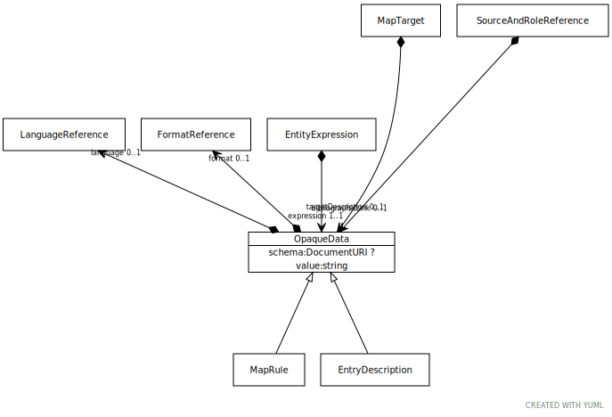

# Type: OpaqueData

Opaque data is the equivalent of an ASN.1 External Type or the XML Schema anyType . An OpaqueData instance
may represent text with an optional spoken or written language code or a formal structure such as embedded HTML,
XML, or MIME encoded data. When a formal structure is included, its type should be specified in the format
attribute and, when the type is an XML variant, the corresponding schema (or DTD) should be included in the
schema parameter.

The OpaqueData data type must be encoded in such a way that the content can be represented by a character string.
Binary data is not permitted, although hyperlinks to binary data are.

URI: [tccm:OpaqueData](https://hotecosystem.org/tccm/OpaqueData)

## Children

 * [EntryDescription](EntryDescription.md) - EntryDescription is a subclass of OpaqueData. The purpose behind this is that there are certain textual fields
 * [MapRule](MapRule.md) - A set of instructions that, when interpreted in the proper context, returns a true/false value, where true means

## Referenced by class

 *  **None** *[➞expression](entityExpression__expression.md)*  REQ  **[OpaqueData](OpaqueData.md)**
 *  **None** *[➞targetDescription](mapTarget__targetDescription.md)*  OPT  **[OpaqueData](OpaqueData.md)**
 *  **None** *[➞bibliographicLink](sourceAndRoleReference__bibliographicLink.md)*  OPT  **[OpaqueData](OpaqueData.md)**

## Attributes

### Own

 * [➞format](opaqueData__format.md)  OPT
    * Description: The format or encoding for value. This is typically recorded as the URI of a Mime Type
    * range: [FormatReference](FormatReference.md)
 * [➞language](opaqueData__language.md)  OPT
    * Description: A reference to the written or spoken language used in value.
    * range: [LanguageReference](LanguageReference.md)
 * [➞schema](opaqueData__schema.md)  OPT
    * Description: If the format of the document involves an XML encoding, this contains the URI of a document that carries
the corresponding XML Schema or DTD.
    * range: [DocumentURI](types/DocumentURI.md)
 * [➞value](opaqueData__value.md)  REQ
    * Description: The instance value. Note that instance value should be encoded in such a way that it allows embedded
structures. As an example, in XML Schema, this encoding should be to xs:anyType or an equivalent.
    * range: [String](types/String.md)
