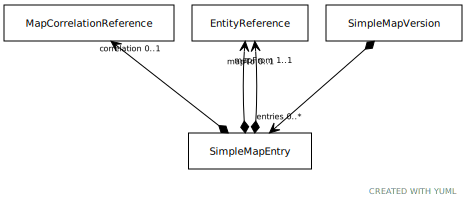

# Type: SimpleMapEntry

A map entry represents the set of mappings that share the same mapFrom entity identifier. There may be at most
one MapEntry for any unique EntityDescription within the context of a given MapVersion. Note also that is
considered unidirectional from the perspective of the TCCM model. If one wishes that, class A in code system C1
maps to class T in code system C2, and visa versa, one needs to create two map versions - the first from a
version of C1 to a version of C2 and the second from a version of C2 to a version of C1.

"`SimpleMapEntry`" is used to represent simple maps that don't involve cascading rules, target expressions, etc.

URI: [tccm:SimpleMapEntry](https://hotecosystem.org/tccm/SimpleMapEntry)

## Referenced by class

 *  **None** *[➞entries](simpleMapVersion__entries.md)*  0..*  **[SimpleMapEntry](SimpleMapEntry.md)**

## Attributes

### Own

 * [➞correlation](simpleMapEntry__correlation.md)  OPT
    * Description: A reference to how well the mapping correlates. Example correlations might be Exact, not mappable, partial
overlap, narrower than, etc.
    * range: [MapCorrelationReference](MapCorrelationReference.md)
 * [➞mapFrom](simpleMapEntry__mapFrom.md)  REQ
    * Description: The source entity.  EntityReference must be a member of the fromValueSetDefinition part of the map definition.
EntityReferences in the fromValueSetDefinition that do not occur in a "`mapFrom`" entry are considered as
"unmapped" - meaning that the mapping is incomplete.
    * range: [EntityReference](EntityReference.md)
 * [➞mapTo](simpleMapEntry__mapTo.md)  OPT
    * Description: The target entity.  EntityReference must be a member of the toValueSetDefinition part of the map definition.
The absence of a mapTo asserts that *no* map exists for "`mapFrom`".
    * range: [EntityReference](EntityReference.md)
