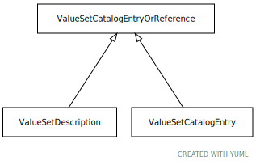

# Type: ValueSetCatalogEntryOrReference

Either a description of ana abstract value set or a reference to an official entry

URI: [tccm:ValueSetCatalogEntryOrReference](https://hotecosystem.org/tccm/ValueSetCatalogEntryOrReference)

## Children

 * [ValueSetCatalogEntry](ValueSetCatalogEntry.md) - A ValueSetCatalogEntry carries information about the creators, distributors, purpose, use, etc. about a value set.
 * [ValueSetDescription](ValueSetDescription.md) - A description of a value

## Referenced by class

## Attributes

