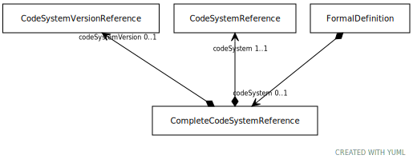

# Type: CompleteCodeSystemReference

An entry that, when resolved, returns all of the active entity references in a given code system. This includes
all entity references that appear as the source of one or more statements in the code system, whether the
assertions are made directly by a version of the code system or indirectly by a version of a different code
system that is imported. Note that targets are not included to prevent codes from rdf, rdfs, owl, etc. being
included in this resolution set.

URI: [tccm:CompleteCodeSystemReference](https://hotecosystem.org/tccm/CompleteCodeSystemReference)

## Referenced by class

 *  **None** *[➞codeSystem](formalDefinition__complete_code_system.md)*  OPT  **[CompleteCodeSystemReference](CompleteCodeSystemReference.md)**

## Attributes

### Own

 * [➞codeSystem](completeCodeSystemReference__codeSystem.md)  REQ
    * Description: A reference to the code system whose codes are to be included.
    * range: [CodeSystemReference](CodeSystemReference.md)
 * [➞codeSystemVersion](completeCodeSystemReference__codeSystemVersion.md)  OPT
    * Description: A reference to the specific version of the code system to include. If not supplied, the specific
version of the code system is determined in the resolution call itself.
    * range: [CodeSystemVersionReference](CodeSystemVersionReference.md)
