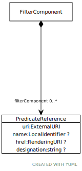

# Type: PredicateReference

An EntityReference that serves the role of predicate. Note that this varies slightly from the base class of
NameAndMeaningReference because the name attribute is a namespace/name combination rather than a simple name
scoped exclusively by the domain.

URI: [https://hotecosystem.org/tccm/filtersandsorting/PredicateReference](https://hotecosystem.org/tccm/filtersandsorting/PredicateReference)

## Referenced by class

 *  **[FilterComponent](FilterComponent.md)** *[FilterComponent➞filterComponent](FilterComponent_filterComponent.md)*  0..*  **[PredicateReference](PredicateReference.md)**
 *  **None** *[filterComponent](filterComponent.md)*  0..*  **[PredicateReference](PredicateReference.md)**

## Attributes

### Own

 * [PredicateReference➞designation](PredicateReference_designation.md)  OPT
    * range: [String](types/String.md)
 * [PredicateReference➞href](PredicateReference_href.md)  OPT
    * range: [RenderingURI](types/RenderingURI.md)
 * [PredicateReference➞name](PredicateReference_name.md)  REQ
    * range: [CURIE](types/CURIE.md)
 * [PredicateReference➞uri](PredicateReference_uri.md)  REQ
    * range: [ExternalURI](types/ExternalURI.md)
