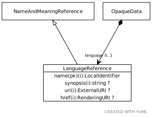

# Type: LanguageReference

A reference to a spoken or written human language.

URI: [tccm:LanguageReference](https://hotecosystem.org/tccm/LanguageReference)

## Parents

 *  is_a: [NameAndMeaningReference](NameAndMeaningReference.md) - A NameAndMeaningReference consists of a local identifier that references a unique meaning within the context of a given domain in a TCCM service instance and a globally unique URI that identifies the intended meaning of the identifier.

## Attributes

### Inherited from NameAndMeaningReference:

 * [NameAndMeaningReference➞href](NameAndMeaningReference_href.md)  OPT
    * range: [RenderingURI](types/RenderingURI.md)
 * [NameAndMeaningReference➞name](NameAndMeaningReference_name.md)  REQ
    * range: [LocalIdentifier](types/LocalIdentifier.md)
 * [NameAndMeaningReference➞uri](NameAndMeaningReference_uri.md)  OPT
    * range: [ExternalURI](types/ExternalURI.md)
