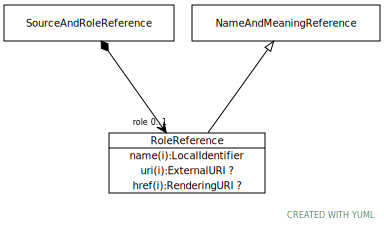

# Type: RoleReference

A reference to a role that an individual, organization, or bibliographic reference can play in the construction of a resource or resource component.

URI: [tccm:RoleReference](https://hotecosystem.org/tccm/RoleReference)

## Parents

 *  is_a: [NameAndMeaningReference](NameAndMeaningReference.md) - A NameAndMeaningReference consists of a local identifier that references a unique meaning within the context of a given domain in a TCCM service instance and a globally unique URI that identifies the intended meaning of the identifier.

## Referenced by class

 *  **[SourceAndRoleReference](SourceAndRoleReference.md)** *[SourceAndRoleReference➞role](SourceAndRoleReference_role.md)*  OPT  **[RoleReference](RoleReference.md)**
 *  **None** *[role](role.md)*  OPT  **[RoleReference](RoleReference.md)**

## Attributes

### Inherited from NameAndMeaningReference:

 * [NameAndMeaningReference➞href](NameAndMeaningReference_href.md)  OPT
    * range: [RenderingURI](types/RenderingURI.md)
 * [NameAndMeaningReference➞name](NameAndMeaningReference_name.md)  REQ
    * range: [LocalIdentifier](types/LocalIdentifier.md)
 * [NameAndMeaningReference➞uri](NameAndMeaningReference_uri.md)  OPT
    * range: [ExternalURI](types/ExternalURI.md)
