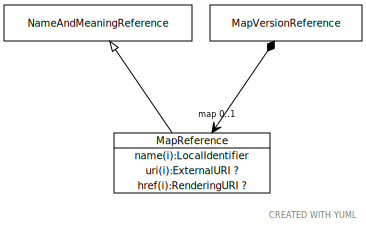

# Type: MapReference

A reference to an abstract map.

URI: [tccm:MapReference](https://hotecosystem.org/tccm/MapReference)

## Parents

 *  is_a: [NameAndMeaningReference](NameAndMeaningReference.md) - A NameAndMeaningReference consists of a local identifier that references a unique meaning within the context of a given domain in a TCCM service instance and a globally unique URI that identifies the intended meaning of the identifier.

## Referenced by class

 *  **[MapVersionReference](MapVersionReference.md)** *[MapVersionReference➞map](MapVersionReference_map.md)*  OPT  **[MapReference](MapReference.md)**
 *  **None** *[map](map.md)*  OPT  **[MapReference](MapReference.md)**

## Attributes

### Inherited from NameAndMeaningReference:

 * [NameAndMeaningReference➞href](NameAndMeaningReference_href.md)  OPT
    * range: [RenderingURI](types/RenderingURI.md)
 * [NameAndMeaningReference➞name](NameAndMeaningReference_name.md)  REQ
    * Description: An identifier that uniquely names the reference within the context of the particular reference type.
    * range: [LocalIdentifier](types/LocalIdentifier.md)
 * [NameAndMeaningReference➞synopsis](NameAndMeaningReference_synopsis.md)  OPT
    * Description: A summary of the role and purpose of the actual reference
    * range: [String](types/String.md)
 * [NameAndMeaningReference➞uri](NameAndMeaningReference_uri.md)  OPT
    * range: [ExternalURI](types/ExternalURI.md)
