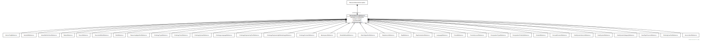

# Type: NameAndMeaningReference

A NameAndMeaningReference consists of a local identifier that references a unique meaning within the context of a given domain in a TCCM service instance and a globally unique URI that identifies the intended meaning of the identifier.

URI: [tccm:NameAndMeaningReference](https://hotecosystem.org/tccm/NameAndMeaningReference)

## Children

 * [AssociationReference](AssociationReference.md) - A name or identifier that uniquely names an association instance in a code system.
 * [BindingQualifierReference](BindingQualifierReference.md) - A reference to an entity that describes the role that a given value set binding plays for a concept domain. T ypical values represent “overall,” “minimum” or “maximum,” the significance of which can be found in H L7 Version 3 documentation.
 * [CaseSignificanceReference](CaseSignificanceReference.md) - A reference to an entity that describes significance of the case in term or designation.
 * [CodeSystemCategoryReference](CodeSystemCategoryReference.md) - A reference to information about a paradigm model used to create an ontology (a.k.a. knowledge representation paradigm).
 * [CodeSystemReference](CodeSystemReference.md) - A reference to a code system or ontology.
 * [CodeSystemVersionReference](CodeSystemVersionReference.md) - A reference to a specific version of code system and, if known, the code system which it is a version of.
 * [ConceptDomainReference](ConceptDomainReference.md) - A reference to a concept domain.
 * [ContextReference](ContextReference.md) - A reference to a realm or context.
 * [DesignationFidelityReference](DesignationFidelityReference.md) - A reference to a description about designation faithfulness or accuracy.
 * [DesignationTypeReference](DesignationTypeReference.md) - A reference to a designation type or form such as “short name,” “abbreviation,” “eponym.”
 * [FormalityLevelReference](FormalityLevelReference.md) - A reference to a description of the relative formality an ontology.
 * [FormatReference](FormatReference.md) - A reference to a particular way that information is encoded for storage or transmission.
 * [LanguageReference](LanguageReference.md) - A reference to a spoken or written human language.
 * [MapCorrelationReference](MapCorrelationReference.md) - A reference to a way that the source and target in a map can be related or assessed.
 * [MapReference](MapReference.md) - A reference to an abstract map.
 * [MapVersionReference](MapVersionReference.md) - A reference to a map version and the corresponding map, if known.
 * [MatchAlgorithmReference](MatchAlgorithmReference.md) - A reference to an algorithm used for selecting and filtering data.
 * [ModelAttributeReference](ModelAttributeReference.md) - A reference to an attribute defined in the CTS2 specification.
 * [NamespaceReference](NamespaceReference.md) - A reference to a conceptual space that groups identifiers to avoid conflict with items that have the same name but different meanings.
 * [OntologyDomainReference](OntologyDomainReference.md) - A reference to a subject domain for an ontology.
 * [OntologyEngineeringMethodologyReference](OntologyEngineeringMethodologyReference.md) - A reference to a method model that can be used to create an ontology.
 * [OntologyEngineeringToolReference](OntologyEngineeringToolReference.md) - A reference to a tool that can be used to create an ontology.
 * [OntologyLanguageReference](OntologyLanguageReference.md) - A reference to a language in which an ontology may be implemented.
 * [OntologySyntaxReference](OntologySyntaxReference.md) - A reference to a syntax in which an ontology may be represented.
 * [OntologyTaskReference](OntologyTaskReference.md) - A reference to a purpose for which an ontology can be designed.
 * [OntologyTypeReference](OntologyTypeReference.md) - A reference to the nature of the content of an ontology.
 * [ReasoningAlgorithmReference](ReasoningAlgorithmReference.md) - A reference to a formal algorithm for making inferences about an ontology.
 * [RoleReference](RoleReference.md) - A reference to a role that an individual, organization, or bibliographic reference can play in the construction of a resource or resource component.
 * [SourceAndRoleReference](SourceAndRoleReference.md) - A reference to a source that also includes the role that the source played and/or fixes the particular chapter, page, or other element within the reference.
 * [SourceReference](SourceReference.md) - A reference to an individual, organization of bibliographic reference.
 * [StatusReference](StatusReference.md) - A reference to a state in an external ontology authoring workflow.
 * [ValueSetDefinitionReference](ValueSetDefinitionReference.md) - A reference to a set of rules for constructing a value set along with the corresponding value set if known.
 * [ValueSetReference](ValueSetReference.md) - A reference to a named set of entity references.
 * [VersionTagReference](VersionTagReference.md) - A reference to a tag that can be assigned to versionable resources within the context of a service implementation.

## Referenced by class

 *  **[ResourceVersionDescription](ResourceVersionDescription.md)** *[ResourceVersionDescription➞predecessor](ResourceVersionDescription_predecessor.md)*  OPT  **[NameAndMeaningReference](NameAndMeaningReference.md)**
 *  **None** *[predecessor](predecessor.md)*  OPT  **[NameAndMeaningReference](NameAndMeaningReference.md)**

## Attributes

### Own

 * [NameAndMeaningReference➞href](NameAndMeaningReference_href.md)  OPT
    * range: [RenderingURI](types/RenderingURI.md)
 * [NameAndMeaningReference➞name](NameAndMeaningReference_name.md)  REQ
    * Description: An identifier that uniquely names the reference within the context of the particular reference type.
    * range: [LocalIdentifier](types/LocalIdentifier.md)
 * [NameAndMeaningReference➞synopsis](NameAndMeaningReference_synopsis.md)  OPT
    * Description: A summary of the role and purpose of the actual reference
    * range: [String](types/String.md)
 * [NameAndMeaningReference➞uri](NameAndMeaningReference_uri.md)  OPT
    * range: [ExternalURI](types/ExternalURI.md)
