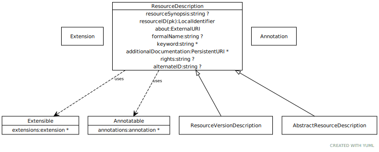

# Type: ResourceDescription

ResourceDescription represents the shared characteristics common to both abstract and resource version descriptions. ResourceDescription is an abstract type and, as such, cannot be directly created. Resource descriptions are Changeable, meaning that they have identity and can be created, updated, and deleted.

URI: [tccm:ResourceDescription](https://hotecosystem.org/tccm/ResourceDescription)

## Uses Mixins

 *  mixin: [Extensible](Extensible.md) - mixin for classes that support extension
 *  mixin: [Annotatable](Annotatable.md) - mixin for classes that support annotations

## Children

 * [AbstractResourceDescription](AbstractResourceDescription.md) - The description of the characteristics of a resource that are independent of the resource content.
 * [ResourceVersionDescription](ResourceVersionDescription.md) - Information about the source, format, release date, version identifier, etc. of a specific version of an abstract resource.

## Referenced by class

## Attributes

### Own

 * [ResourceDescription➞about](ResourceDescription_about.md)  REQ
    * Description: The (or a) definitive URI that represents the resource being described. Note that this is NOT the URI of the resource description in the TCCM or other format, but of the resource itself. As an example, the about URI for the Wine ontology would be “http://www.w3.org/TR/2003/PR-owl-guide-2003 1209/wine#.” The NCI Thesaurus has, among others, the about URI of http://ncicb.nci.nih.gov/xml/owl/EVS/Thesaurus.owl#. HL7 uses ISO Object Identifiers (OIDs) to label resources so, from the HL7 perspective, the about URI of the NCI Thesaurus would be “urn:oid:2.16.840. 1.113883.3.26.1.1”
    * range: [ExternalURI](types/ExternalURI.md)
 * [ResourceDescription➞additionalDocumentation](ResourceDescription_additionalDocumentation.md)  0..*
    * Description: A reference to a document that provide additional information about the resource.
    * range: [PersistentURI](types/PersistentURI.md)
 * [ResourceDescription➞alternateID](ResourceDescription_alternateID.md)  OPT
    * Description: An alternative identifier that uniquely names this resource in other environments as contexts. As an example, if a resource had both an ISO Object Identifier and a DNS name, the DNS name might be assigned as the entryID of the resource by one service while the ISO OID would be recorded as an alternateURI using the “urn:oid” prefix. Note that alternateIds can be added or removed during resource updates.
    * range: [String](types/String.md)
 * [ResourceDescription➞formalName](ResourceDescription_formalName.md)  OPT
    * Description: The formal or officially assigned name of this resource, if any.
    * range: [String](types/String.md)
 * [ResourceDescription➞keyword](ResourceDescription_keyword.md)  0..*
    * Description: Additional identifiers that are used to index and locate the resource.
    * range: [String](types/String.md)
 * [ResourceDescription➞rights](ResourceDescription_rights.md)  OPT
    * Description: Copyright and IP information. Note that rights applies to the source resource, not the CTS2 rendering.
    * range: [String](types/String.md)
 * [resourceID](resourceID.md)  REQ
    * Description: A local identifier that uniquely names the resource within the context of the describedResourceType and implementing service. As an example, this might be “SCT” for the SNOMED-CT code system, “SCT-2010AA” for a SNOMED-CT code system version.
    * range: [LocalIdentifier](types/LocalIdentifier.md)
 * [resourceSynopsis](resourceSynopsis.md)  OPT
    * Description: A textual summary of the resource - what it is, what it is for, etc.
    * range: [String](types/String.md)

### Mixed in from annotatable:

 * [annotations](annotations.md)  0..*
    * Description: a collection of tag/text tuples with the semantics of OWL Annotation
    * range: [Annotation](Annotation.md)

### Mixed in from extensible:

 * [extensions](extensions.md)  0..*
    * Description: a tag/text tuple attached to an arbitrary element
    * range: [Extension](Extension.md)
