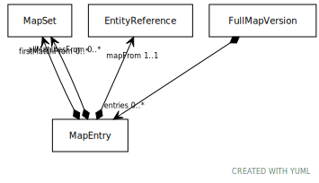

# Type: MapEntry

A "complex map" that defines an ordered set of rules for mapping from "`mapFrom`" to one or more targets

URI: [tccm:MapEntry](https://hotecosystem.org/tccm/MapEntry)

## Referenced by class

 *  **None** *[➞entries](fullMapVersion__entries.md)*  0..*  **[MapEntry](MapEntry.md)**

## Attributes

### Own

 * [➞allMatchesFrom](mapEntry__allMatchesFrom.md)  0..*
    * Description: Process all map sets, returning every set that has a matching target
    * range: [MapSet](MapSet.md)
 * [➞firstMatchFrom](mapEntry__firstMatchFrom.md)  0..*
    * Description: Processing stop at the first map set that has a matching target.
    * range: [MapSet](MapSet.md)
 * [➞mapFrom](mapEntry__mapFrom.md)  REQ
    * Description: The source entity.  EntityReference must be a member of the fromValueSetDefinition part of the map definition.
EntityReferences in the fromValueSetDefinition that do not occur in a "`mapFrom`" entry are considered as
"unmapped" - meaning that the mapping is incomplete.
    * range: [EntityReference](EntityReference.md)
