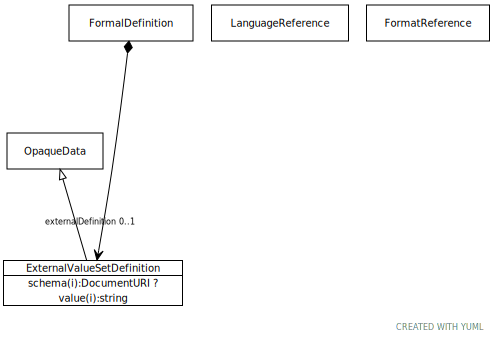

# Type: ExternalValueSetDefinition

A definition of a value set whose format and semantics is specified outside of the core
TCCM specification. If a given CTTCCMS2 service recognizes the syntax and semantics of this definition, it may
call the appropriate process to resolve it. If the definition is not recognized, a TCCM service implementation
must not process the containing value set definition and, instead, return an error.

URI: [tccm:ExternalValueSetDefinition](https://hotecosystem.org/tccm/ExternalValueSetDefinition)

## Parents

 *  is_a: [OpaqueData](OpaqueData.md) - Opaque data is the equivalent of an ASN.1 External Type or the XML Schema anyType . An OpaqueData instance

## Referenced by class

 *  **None** *[➞externalDefinition](formalDefinition__external_value_set_definition.md)*  OPT  **[ExternalValueSetDefinition](ExternalValueSetDefinition.md)**

## Attributes

### Inherited from OpaqueData:

 * [➞format](opaqueData__format.md)  OPT
    * Description: The format or encoding for value. This is typically recorded as the URI of a Mime Type
    * range: [FormatReference](FormatReference.md)
 * [➞language](opaqueData__language.md)  OPT
    * Description: A reference to the written or spoken language used in value.
    * range: [LanguageReference](LanguageReference.md)
 * [➞schema](opaqueData__schema.md)  OPT
    * Description: If the format of the document involves an XML encoding, this contains the URI of a document that carries
the corresponding XML Schema or DTD.
    * range: [DocumentURI](types/DocumentURI.md)
 * [➞value](opaqueData__value.md)  REQ
    * Description: The instance value. Note that instance value should be encoded in such a way that it allows embedded
structures. As an example, in XML Schema, this encoding should be to xs:anyType or an equivalent.
    * range: [String](types/String.md)
