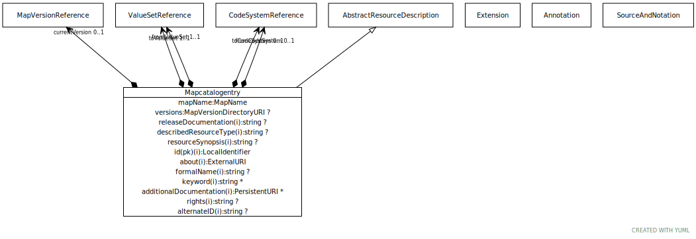

# Type: mapcatalogentry

An entry in a catalog of maps - organized collections of rules that describe how information encoded using one
set of value meanings can be transformed into a second, related set of meanings. A map catalog contains
information about who is responsible for creating and distributing the rules, the source code system or value set,
the target code system or value set, how often the rules are updated, how they are distributed, etc.

URI: [tccm:Mapcatalogentry](https://hotecosystem.org/tccm/Mapcatalogentry)

## Parents

 *  is_a: [AbstractResourceDescription](AbstractResourceDescription.md) - The description of the characteristics of a resource that are independent of the resource content.

## Attributes

### Own

 * [➞currentVersion](mapcatalogentry__currentVersion.md)  OPT
    * Description: The map version associated with this catalog entry that has been assigned the x60CURRENTx60 tag, if any
    * range: [MapVersionReference](MapVersionReference.md)
 * [➞fromCodeSystem](mapcatalogentry__fromCodeSystem.md)  OPT
    * Description: The CodeSystem from which the source codes in the Map are drawn. Note that the source codes may be drawn from
either a CodeSystem or a ValueSet, but not both.
    * range: [CodeSystemReference](CodeSystemReference.md)
 * [➞fromValueSet](mapcatalogentry__fromValueSet.md)  REQ
    * Description: The "`ValueSet`" from which the source codes in the Map are drawn. Note that the source codes may be drawn from
either a x60CodeSystemx60 or a x60ValueSetx60, but not both.
    * range: [ValueSetReference](ValueSetReference.md)
 * [➞mapName](mapcatalogentry__mapName.md)  REQ
    * Description: the name by which the map is known within the context of the TCCM service instance. mapName must uniquely
designate a single, abstract Map within the context of all maps known to the instance of the service.
Note that mapName is not necessarily globally unique and the about URI should be used whenever communication
information about the Map across time or service instances.
    * range: [MapName](types/MapName.md)
 * [➞toCodeSystem](mapcatalogentry__toCodeSystem.md)  OPT
    * Description: the x60CodeSystemx60 from which the target codes in the Map are drawn. Note that the target codes may be drawn from
either a x60CodeSystemx60 or a x60ValueSetx60, but not both.
    * range: [CodeSystemReference](CodeSystemReference.md)
 * [➞toValueSet](mapcatalogentry__toValueSet.md)  REQ
    * Description: the x60ValueSetx60 from which the source codes in the Map are drawn. Note that the target codes may be drawn from
either a x60CodeSystemx60 or a x60ValueSetx60, but not both.
    * range: [ValueSetReference](ValueSetReference.md)
 * [➞versions](mapcatalogentry__versions.md)  OPT
    * Description: A URI that, when resolved, returns the known versions of the containing Map
    * range: [MapVersionDirectoryURI](types/MapVersionDirectoryURI.md)

### Inherited from AbstractResourceDescription:

 * [➞releaseDocumentation](abstractResourceDescription__releaseDocumentation.md)  OPT
    * Description: Documentation about the frequency and nature of releases (version) of this resource.
    * range: [String](types/String.md)
 * [➞releaseFormat](abstractResourceDescription__releaseFormat.md)  0..*
    * Description: A format and notation that the releases (versions) of this resource are published in.
    * range: [SourceAndNotation](SourceAndNotation.md)
 * [➞about](resourceDescription__about.md)  REQ
    * Description: The (or a) definitive URI that represents the resource being described. Note that this is NOT the URI of the
resource description in the TCCM or other format, but of the resource itself. As an example, the about URI
for the Wine ontology would be “http://www.w3.org/TR/2003/PR-owl-guide-2003 1209/wine#.” The NCI Thesaurus
has, among others, the about URI of http://ncicb.nci.nih.gov/xml/owl/EVS/Thesaurus.owl#. HL7 uses ISO Object
Identifiers (OIDs) to label resources so, from the HL7 perspective, the about URI of the NCI Thesaurus would
be “urn:oid:2.16.840. 1.113883.3.26.1.1”
    * range: [ExternalURI](types/ExternalURI.md)
 * [➞additionalDocumentation](resourceDescription__additionalDocumentation.md)  0..*
    * Description: A reference to a document that provide additional information about the resource.
    * range: [PersistentURI](types/PersistentURI.md)
 * [➞alternateID](resourceDescription__alternateID.md)  OPT
    * Description: An alternative identifier that uniquely names this resource in other environments as contexts.
As an example, if a resource had both an ISO Object Identifier and a DNS name, the DNS name might be assigned
as the entryID of the resource by one service while the ISO OID would be recorded as an alternateURI using
the “urn:oid” prefix. Note that alternateIds can be added or removed during resource updates.
    * range: [String](types/String.md)
 * [➞describedResourceType](resourceDescription__describedResourceType.md)  OPT
    * Description: Enumeration of possible types
    * range: [String](types/String.md)
 * [➞formalName](resourceDescription__formalName.md)  OPT
    * Description: The formal or officially assigned name of this resource, if any.
    * range: [String](types/String.md)
 * [➞keyword](resourceDescription__keyword.md)  0..*
    * Description: Additional identifiers that are used to index and locate the resource.
    * range: [String](types/String.md)
 * [➞id](resourceDescription__resourceID.md)  REQ
    * Description: A local identifier that uniquely names the resource within the context of the describedResourceType and
implementing service. As an example, this might be “SCT” for the SNOMED-CT code system, “SCT-2010AA” for a
SNOMED-CT code system version.
    * range: [LocalIdentifier](types/LocalIdentifier.md)
 * [➞resourceSynopsis](resourceDescription__resourceSynopsis.md)  OPT
    * Description: A textual summary of the resource - what it is, what it is for, etc.
    * range: [String](types/String.md)
 * [➞rights](resourceDescription__rights.md)  OPT
    * Description: Copyright and IP information. Note that rights applies to the source resource, not the CTS2 rendering.
    * range: [String](types/String.md)

## Other properties

|  |  |  |
| --- | --- | --- |
| **Comments:** | | CTS2 includes "`fromCodeSystem`" an x60toCodeSystemx60 TCCM accepts only value sets, one form of which is x60CodeSystemReferencex60 |

