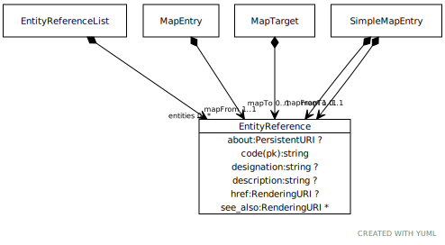

# Type: EntityReference

The URI, namespace/name (if known) and a list of code systems that make assertions about the entity.

URI: [tccm:EntityReference](https://hotecosystem.org/tccm/EntityReference)

## Referenced by class

 *  **None** *[➞entities](entityReferenceList__entities.md)*  0..*  **[EntityReference](EntityReference.md)**
 *  **None** *[➞mapFrom](mapEntry__mapFrom.md)*  REQ  **[EntityReference](EntityReference.md)**
 *  **None** *[➞mapTo](mapTarget__mapTo.md)*  OPT  **[EntityReference](EntityReference.md)**
 *  **None** *[➞mapFrom](simpleMapEntry__mapFrom.md)*  REQ  **[EntityReference](EntityReference.md)**
 *  **None** *[➞mapTo](simpleMapEntry__mapTo.md)*  OPT  **[EntityReference](EntityReference.md)**

## Attributes

### Own

 * [➞about](entityReference__about.md)  OPT
    * Description: The external, permanant URI by which this entity is known.
    * range: [PersistentURI](types/PersistentURI.md)
 * [➞code](entityReference__code.md)  REQ
    * Description: The namespace and name by which this entity is known within the context of the service implementation
    * range: [String](types/String.md)
 * [➞description](entityReference__description.md)  OPT
    * Description: A description or definition of the referenced entity determined by the service
    * range: [String](types/String.md)
 * [➞designation](entityReference__designation.md)  OPT
    * Description: The preferred label for the entity in the context of the service
    * range: [String](types/String.md)
 * [➞href](entityReference__href.md)  OPT
    * Description: A reference to the "official" description of the entity in the context of the defining code system
    * range: [RenderingURI](types/RenderingURI.md)
 * [➞see_also](entityReference__see_also.md)  0..*
    * Description: Additional external links that serve to define or otherwise clarify the intent of the reference
    * range: [RenderingURI](types/RenderingURI.md)
