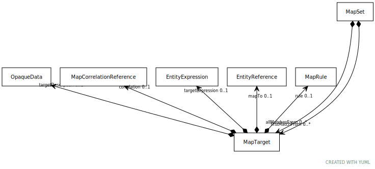

# Type: MapTarget

URI: [tccm:MapTarget](https://hotecosystem.org/tccm/MapTarget)

## Referenced by class

 *  **None** *[➞allMatchesFrom](mapSet__allMatchesFrom.md)*  0..*  **[MapTarget](MapTarget.md)**
 *  **None** *[➞firstMatchFrom](mapSet__firstMatchFrom.md)*  0..*  **[MapTarget](MapTarget.md)**

## Attributes

### Own

 * [➞correlation](mapTarget__correlation.md)  OPT
    * Description: A reference to how well the mapping correlates. Example correlations might be Exact, not mappable, partial
overlap, narrower than, etc.
    * range: [MapCorrelationReference](MapCorrelationReference.md)
 * [➞mapTo](mapTarget__mapTo.md)  OPT
    * Description: The target entity to be used if the rule is satisfied. If not present, the assumption is that the source
entity maps to nothing in this set / rule
    * range: [EntityReference](EntityReference.md)
 * [➞rule](mapTarget__rule.md)  OPT
    * Description: A predicate of some sort that can be used to determine whether this entry meets the mapping criteria. If
absent, the mapping is considered unconditional.
    * range: [MapRule](MapRule.md)
 * [➞targetDescription](mapTarget__targetDescription.md)  OPT
    * Description: A description of the resulting rule. Can be used to carry text to instruct human beings how to do the
mapping as well as additional machine readable instructions.
    * range: [OpaqueData](OpaqueData.md)
 * [➞targetExpression](mapTarget__targetExpression.md)  OPT
    * Description: A formal expression that, when interpreted, results in the map target. This expression could carry an RDF
fragment, an expression in the SNOMED-CT compositional grammar or something else.
    * range: [EntityExpression](EntityExpression.md)
