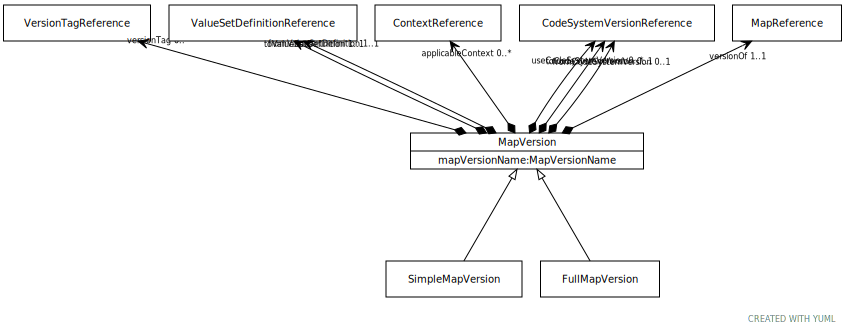

# Type: MapVersion

A specific version of a Map. MapVersion is bound to specific code system versions and/or value set
versions andreferences a set of mapping entries (mapSet) that, if the resource is FINAL, are fixed with respect
to this version.

URI: [tccm:MapVersion](https://hotecosystem.org/tccm/MapVersion)

## Children

 * [FullMapVersion](FullMapVersion.md) - A "complex map" that defines an ordered set of rules for mapping from "`mapFrom`" to one or more targets
 * [SimpleMapVersion](SimpleMapVersion.md)

## Referenced by class

## Attributes

### Own

 * [➞applicableContext](mapVersion__applicableContext.md)  0..*
    * Description: References to the realm, context, or other external factor that determines the applicability of this
particular map version.
    * range: [ContextReference](ContextReference.md)
 * [➞fromCodeSystemVersion](mapVersion__fromCodeSystemVersion.md)  OPT
    * Description: The specific code system version that provided the from entities in this map.
    * range: [CodeSystemVersionReference](CodeSystemVersionReference.md)
 * [➞fromValueSetDefinition](mapVersion__fromValueSetDefinition.md)  REQ
    * Description: The specific value set definition that was used to resolve the from entities in this map.
    * range: [ValueSetDefinitionReference](ValueSetDefinitionReference.md)
 * [➞mapVersionName](mapVersion__mapVersionName.md)  REQ
    * Description: A local identifier that uniquely names this version within the context of the CTS2 service implementation.
    * range: [MapVersionName](types/MapVersionName.md)
 * [➞toCodeSystemVersion](mapVersion__toCodeSystemVersion.md)  OPT
    * Description: The specific code system version that provided the to entities in this map.
    * range: [CodeSystemVersionReference](CodeSystemVersionReference.md)
 * [➞toValueSetDefinition](mapVersion__toValueSetDefinition.md)  REQ
    * Description: The specific value set definition that was used to resolve the to entities in this map.
    * range: [ValueSetDefinitionReference](ValueSetDefinitionReference.md)
 * [➞useCodeSystemVersion](mapVersion__useCodeSystemVersion.md)  0..*
    * Description: A list of code system versions that should be used in the resolution of fromValueSetDefinition and/or
toValueSetDefinition. If present, this states that, for these code systems, these specific versions are to be
used.
    * range: [CodeSystemVersionReference](CodeSystemVersionReference.md)
 * [➞versionOf](mapVersion__versionOf.md)  REQ
    * Description: A reference to the Map resource that this is a version of.
    * range: [MapReference](MapReference.md)
 * [➞versionTag](mapVersion__versionTag.md)  0..*
    * Description: A version tag assigned to this MapVersion instance by the implementing service.
    * range: [VersionTagReference](VersionTagReference.md)
