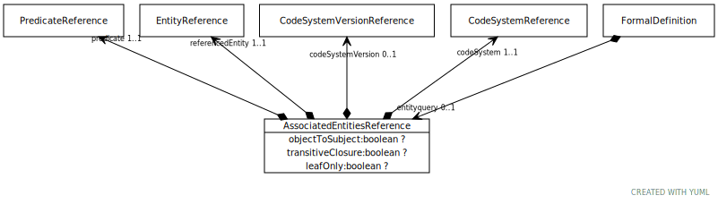

# Type: AssociatedEntitiesReference

The description of a set of entities that are associated with a referenced entity. This description names a
reference entity and an association predicate, which identifies a set of entities that are related to the
reference entity according to a given code system. The description can reference the direct targets of the
association (children), the direct sources of the association (parents), the transitive closure of the
association targets (descendants), the transitive closure of the association sources (ancestors) and can state
whether all intermediate nodes are included in the closure or just the leaf nodes.

Note that the terms “parent” and “children” are asserted in reference to the predicate itself. As an example, in
the association “arm subClassOf bodyPart,” the “parent” is arm and the “child” is bodyPart.

URI: [tccm:AssociatedEntitiesReference](https://hotecosystem.org/tccm/AssociatedEntitiesReference)

## Parents

 *  is_a: [FormalDefinition](FormalDefinition.md) - A value set definition choice

## Referenced by class

## Attributes

### Own

 * [AssociatedEntitiesReference➞codeSystem](AssociatedEntitiesReference_codeSystem.md)  REQ
    * Description: The code system that makes the association assertions.
    * range: [CodeSystemReference](CodeSystemReference.md)
 * [AssociatedEntitiesReference➞codeSystemVersion](AssociatedEntitiesReference_codeSystemVersion.md)  OPT
    * Description: The version of the code system that makes the association assertions. If present, codeSystemVersion must be
a version of codeSystem. If this attribute is present, the referenced version of the code system will always
be used to resolve the associations. If absent, the specific version of the code system to be used in
resolution is determined in the resolve value set definition call itself.
    * range: [CodeSystemVersionReference](CodeSystemVersionReference.md)
 * [AssociatedEntitiesReference➞leafOnly](AssociatedEntitiesReference_leafOnly.md)  OPT
    * Description: False means that all entities in a transitive closure are included.  True means only entities that are not
the subject (or object of objectToSubject is True) of a triple with `predicate` qualify.
    * range: [Boolean](types/Boolean.md)
 * [AssociatedEntitiesReference➞objectToSubject](AssociatedEntitiesReference_objectToSubject.md)  OPT
    * Description: False means that `rererencedEntity` serves in the subject role.  True means object.
    * range: [Boolean](types/Boolean.md)
 * [AssociatedEntitiesReference➞predicate](AssociatedEntitiesReference_predicate.md)  REQ
    * Description: The association predicate to be used in resolving the definition entry. Depending on the setting of `reverse`,
entity references that are the `object` or `predicate` (False) or `subject` of `predicate`
(True) qualify.
    * range: [PredicateReference](PredicateReference.md)
 * [AssociatedEntitiesReference➞referencedEntity](AssociatedEntitiesReference_referencedEntity.md)  REQ
    * Description: The entity reference that is the root of the association description. referencedEntity is not considered to
be part of the resolution of AssociatedEntitiesReference. If it is to be included in the final set, it must
be explicitly named in a second SpecificEntityList construct.
    * range: [EntityReference](EntityReference.md)
 * [AssociatedEntitiesReference➞transitiveClosure](AssociatedEntitiesReference_transitiveClosure.md)  OPT
    * Description: If true and `predicate` is defined as being transitive, the transitive closure of `predicate` selects the
candidates
    * range: [Boolean](types/Boolean.md)
