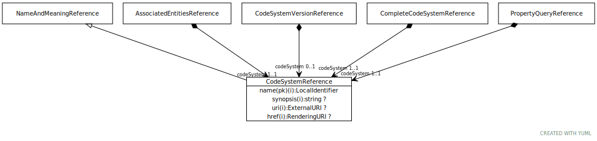

# Type: CodeSystemReference

A reference to a code system or ontology.

URI: [tccm:CodeSystemReference](https://hotecosystem.org/tccm/CodeSystemReference)

## Parents

 *  is_a: [NameAndMeaningReference](NameAndMeaningReference.md) - A NameAndMeaningReference consists of a local identifier that references a unique meaning within the context of

## Referenced by class

 *  **[AssociatedEntitiesReference](AssociatedEntitiesReference.md)** *[AssociatedEntitiesReference➞codeSystem](AssociatedEntitiesReference_codeSystem.md)*  REQ  **[CodeSystemReference](CodeSystemReference.md)**
 *  **[CodeSystemVersionReference](CodeSystemVersionReference.md)** *[CodeSystemVersionReference➞codeSystem](CodeSystemVersionReference_codeSystem.md)*  REQ  **[CodeSystemReference](CodeSystemReference.md)**
 *  **[CompleteCodeSystemReference](CompleteCodeSystemReference.md)** *[CompleteCodeSystemReference➞codeSystem](CompleteCodeSystemReference_codeSystem.md)*  REQ  **[CodeSystemReference](CodeSystemReference.md)**
 *  **[PropertyQueryReference](PropertyQueryReference.md)** *[PropertyQueryReference➞codeSystem](PropertyQueryReference_codeSystem.md)*  REQ  **[CodeSystemReference](CodeSystemReference.md)**
 *  **None** *[codeSystem](codeSystem.md)*  REQ  **[CodeSystemReference](CodeSystemReference.md)**

## Attributes

### Inherited from NameAndMeaningReference:

 * [NameAndMeaningReference➞href](NameAndMeaningReference_href.md)  OPT
    * range: [RenderingURI](types/RenderingURI.md)
 * [NameAndMeaningReference➞name](NameAndMeaningReference_name.md)  REQ
    * Description: An identifier that uniquely names the reference within the context of the particular reference type.
    * range: [LocalIdentifier](types/LocalIdentifier.md)
 * [NameAndMeaningReference➞synopsis](NameAndMeaningReference_synopsis.md)  OPT
    * Description: A summary of the role and purpose of the actual reference
    * range: [String](types/String.md)
 * [NameAndMeaningReference➞uri](NameAndMeaningReference_uri.md)  OPT
    * range: [ExternalURI](types/ExternalURI.md)
