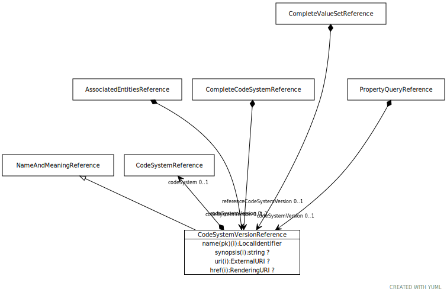

# Type: CodeSystemVersionReference

A reference to a specific version of code system and, if known, the code system which it is a version of.

URI: [tccm:CodeSystemVersionReference](https://hotecosystem.org/tccm/CodeSystemVersionReference)

## Parents

 *  is_a: [NameAndMeaningReference](NameAndMeaningReference.md) - A NameAndMeaningReference consists of a local identifier that references a unique meaning within the context of

## Referenced by class

 *  **[AssociatedEntitiesReference](AssociatedEntitiesReference.md)** *[AssociatedEntitiesReference➞codeSystemVersion](AssociatedEntitiesReference_codeSystemVersion.md)*  OPT  **[CodeSystemVersionReference](CodeSystemVersionReference.md)**
 *  **[CompleteCodeSystemReference](CompleteCodeSystemReference.md)** *[CompleteCodeSystemReference➞codeSystemVersion](CompleteCodeSystemReference_codeSystemVersion.md)*  OPT  **[CodeSystemVersionReference](CodeSystemVersionReference.md)**
 *  **[CompleteValueSetReference](CompleteValueSetReference.md)** *[CompleteValueSetReference➞referenceCodeSystemVersion](CompleteValueSetReference_referenceCodeSystemVersion.md)*  OPT  **[CodeSystemVersionReference](CodeSystemVersionReference.md)**
 *  **[PropertyQueryReference](PropertyQueryReference.md)** *[PropertyQueryReference➞codeSystemVersion](PropertyQueryReference_codeSystemVersion.md)*  OPT  **[CodeSystemVersionReference](CodeSystemVersionReference.md)**
 *  **None** *[codeSystemVersion](codeSystemVersion.md)*  OPT  **[CodeSystemVersionReference](CodeSystemVersionReference.md)**
 *  **None** *[referenceCodeSystemVersion](referenceCodeSystemVersion.md)*  OPT  **[CodeSystemVersionReference](CodeSystemVersionReference.md)**

## Attributes

### Own

 * [CodeSystemVersionReference➞codeSystem](CodeSystemVersionReference_codeSystem.md)  REQ
    * range: [CodeSystemReference](CodeSystemReference.md)

### Inherited from NameAndMeaningReference:

 * [NameAndMeaningReference➞href](NameAndMeaningReference_href.md)  OPT
    * range: [RenderingURI](types/RenderingURI.md)
 * [NameAndMeaningReference➞name](NameAndMeaningReference_name.md)  REQ
    * Description: An identifier that uniquely names the reference within the context of the particular reference type.
    * range: [LocalIdentifier](types/LocalIdentifier.md)
 * [NameAndMeaningReference➞synopsis](NameAndMeaningReference_synopsis.md)  OPT
    * Description: A summary of the role and purpose of the actual reference
    * range: [String](types/String.md)
 * [NameAndMeaningReference➞uri](NameAndMeaningReference_uri.md)  OPT
    * range: [ExternalURI](types/ExternalURI.md)
