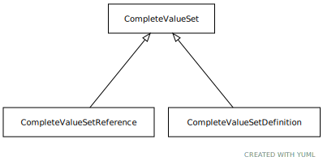

# Type: CompleteValueSet

URI: [tccm:CompleteValueSet](https://hotecosystem.org/tccm/CompleteValueSet)

## Children

 * [CompleteValueSetDefinition](CompleteValueSetDefinition.md) - An embedded value set definition
 * [CompleteValueSetReference](CompleteValueSetReference.md) - A reference to a value set that, when resolved, results in a set of entity references that are included in this

## Referenced by class

## Attributes

