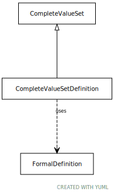

# Type: CompleteValueSetDefinition

An embedded value set definition

URI: [tccm:CompleteValueSetDefinition](https://hotecosystem.org/tccm/CompleteValueSetDefinition)

## Parents

 *  is_a: [CompleteValueSet](CompleteValueSet.md)

## Uses Mixins

 *  mixin: [FormalDefinition](FormalDefinition.md) - A value set definition choice

## Attributes

