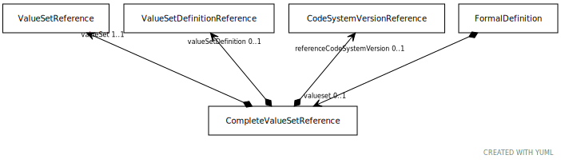

# Type: CompleteValueSetReference

A reference to a value set that, when resolved, results in a set of entity references that are included in this
entry. An entry of this type can just name a value set, meaning that the specific definition is determined in the
resolve value set call, can name both a value set and value set definition, meaning that the specific definition
is always used in the resolution. It can also specify one or more code system versions to be used in the
resolution of the named value set.

URI: [tccm:CompleteValueSetReference](https://hotecosystem.org/tccm/CompleteValueSetReference)

## Parents

 *  is_a: [CompleteValueSet](CompleteValueSet.md)

## Referenced by class

## Attributes

### Own

 * [CompleteValueSetReference➞referenceCodeSystemVersion](CompleteValueSetReference_referenceCodeSystemVersion.md)  OPT
    * Description: A reference to a CodeSystemVersion that will be used to resolve this call. referenceCodeSy will only be used
if one or more components of the resolution of value Set identify a code system without specifying a specific
version. At most, only one version of a given code system may appear in the referenceCodeSystemVersion list.
While CTS2 service implementations must resolve resolution calls for definitions that carry unused reference
Code SystemV entries, they may choose to issue a warning at the time the definition is created or loaded.
    * range: [CodeSystemVersionReference](CodeSystemVersionReference.md)
 * [CompleteValueSetReference➞valueSet](CompleteValueSetReference_valueSet.md)  REQ
    * Description: A reference to the value set whose definition supplies a set of entity references.
    * range: [ValueSetReference](ValueSetReference.md)
 * [CompleteValueSetReference➞valueSetDefinition](CompleteValueSetReference_valueSetDefinition.md)  OPT
    * Description: A reference to a particular definition of valueSet that is to be used in resolving this reference. If absent,
the specific definition is determined by the resolve value set call. If present, valueSetDefinition must be
a definition of valueSet and will always be used to resolve this entity set.
    * range: [ValueSetDefinitionReference](ValueSetDefinitionReference.md)
