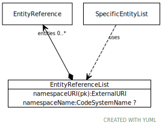

# Type: EntityReferenceList

A collection (set) of zero or more entity references that belong to the same scoping namespace

URI: [tccm:EntityReferenceList](https://hotecosystem.org/tccm/EntityReferenceList)

## Mixin for

 * [SpecificEntityList](SpecificEntityList.md) (mixin)  - A list of specific entity references that are to be included in the definition. When specified in this form,

## Referenced by class

## Attributes

### Own

 * [EntityReferenceList➞entities](EntityReferenceList_entities.md)  0..*
    * Description: The entity references ("concept codes") in the list
    * range: [EntityReference](EntityReference.md)
 * [EntityReferenceList➞namespaceName](EntityReferenceList_namespaceName.md)  OPT
    * Description: The local identifier assigned to this namespace
    * range: [CodeSystemName](types/CodeSystemName.md)
 * [EntityReferenceList➞namespaceURI](EntityReferenceList_namespaceURI.md)  REQ
    * Description: The URI associated with the supplied namespace as determined by the author/service instance
    * range: [ExternalURI](types/ExternalURI.md)
