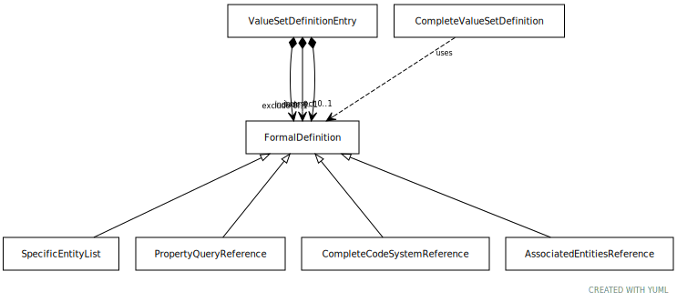

# Type: FormalDefinition

A value set definition choice

URI: [tccm:FormalDefinition](https://hotecosystem.org/tccm/FormalDefinition)

## Children

 * [AssociatedEntitiesReference](AssociatedEntitiesReference.md) - The description of a set of entities that are associated with a referenced entity. This description names a
 * [CompleteCodeSystemReference](CompleteCodeSystemReference.md) - An entry that, when resolved, returns all of the active entity references in a given code system. This includes
 * [PropertyQueryReference](PropertyQueryReference.md) - A description of a set of entity references that are determined by applying a filter to the attribute(s) or
 * [SpecificEntityList](SpecificEntityList.md) - A list of specific entity references that are to be included in the definition. When specified in this form,

## Mixin for

 * [CompleteValueSetDefinition](CompleteValueSetDefinition.md) (mixin)  - An embedded value set definition

## Referenced by class

 *  **[ValueSetDefinitionEntry](ValueSetDefinitionEntry.md)** *[ValueSetDefinitionEntry➞definition](ValueSetDefinitionEntry_definition.md)*  REQ  **[FormalDefinition](FormalDefinition.md)**
 *  **None** *[definition](definition.md)*  REQ  **[FormalDefinition](FormalDefinition.md)**

## Attributes

