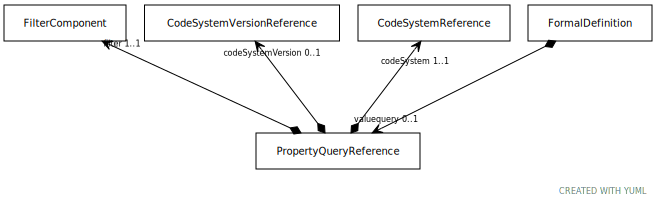

# Type: PropertyQueryReference

A description of a set of entity references that are determined by applying a filter to the attribute(s) or
property(s) that appear in an EntityDescription in a specified code system.

URI: [tccm:PropertyQueryReference](https://hotecosystem.org/tccm/PropertyQueryReference)

## Referenced by class

 *  **None** *[➞valuequery](formalDefinition__property_query.md)*  OPT  **[PropertyQueryReference](PropertyQueryReference.md)**

## Attributes

### Own

 * [➞codeSystem](propertyQueryReference__codeSystem.md)  REQ
    * Description: The code system that contains the assertions that form the attributes or properties to be tested.
    * range: [CodeSystemReference](CodeSystemReference.md)
 * [➞codeSystemVersion](propertyQueryReference__codeSystemVersion.md)  OPT
    * Description: The version of the code system that makes the assertions. If present, codeSystemVersion must be a version of
codeSystem. If this attribute is present, the referenced version of the code system will always be used to
resolve the attributes or properties. If absent, the specific version of the code system to be used in
resolution is determined in the resolve value set definition call itself.
    * range: [CodeSystemVersionReference](CodeSystemVersionReference.md)
 * [➞filter](propertyQueryReference__filter.md)  REQ
    * Description: The filter to be applied to entities in the referenced code system.
    * range: [FilterComponent](FilterComponent.md)
