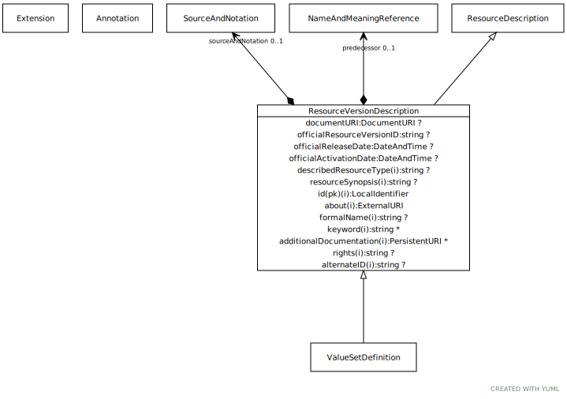

# Type: ResourceVersionDescription

Information about the source, format, release date, version identifier, etc. of a specific version of an
abstract resource.

URI: [tccm:ResourceVersionDescription](https://hotecosystem.org/tccm/ResourceVersionDescription)

## Parents

 *  is_a: [ResourceDescription](ResourceDescription.md) - ResourceDescription represents the shared characteristics common to both abstract and resource version

## Children

 * [ValueSetDefinition](ValueSetDefinition.md) - A ValueSetDefinition describes the rules that determine which entity references (value meanings) belong to a

## Referenced by class

## Attributes

### Own

 * [ResourceVersionDescription➞documentURI](ResourceVersionDescription_documentURI.md)  OPT
    * Description: A URI that identifies the specific version, language, and notation of the about resource. This URI needs to be constructed in such a way that, if necessary, it will be possible to differentiate resource versions that were loaded from different document syntaxes. As an example, if an image of a wine ontology was loaded from a resource that was in Manchester Syntax, it should be given a different URI than the image loaded from the RDF/XML syntax. The reasoning behind this is, even in cases where different syntaxes are 100% compatible the transformation into the TCCM model may not be identical.
    * range: [DocumentURI](types/DocumentURI.md)
 * [ResourceVersionDescription➞officialActivationDate](ResourceVersionDescription_officialActivationDate.md)  OPT
    * Description: The date that this version of the resource is stated by its publishers to go into effect.
    * range: [DateAndTime](types/DateAndTime.md)
 * [ResourceVersionDescription➞officialReleaseDate](ResourceVersionDescription_officialReleaseDate.md)  OPT
    * Description: The date that this version of the resource officially became available.
    * range: [DateAndTime](types/DateAndTime.md)
 * [ResourceVersionDescription➞officialResourceVersionID](ResourceVersionDescription_officialResourceVersionID.md)  OPT
    * Description: An official label or identifier that was assigned to this version by its publisher
    * range: [String](types/String.md)
 * [ResourceVersionDescription➞predecessor](ResourceVersionDescription_predecessor.md)  OPT
    * Description: A reference to the name and URI version of the resource from which this current version is derived - the
version of the resource that immediately preceded it.
    * range: [NameAndMeaningReference](NameAndMeaningReference.md)
 * [ResourceVersionDescription➞sourceAndNotation](ResourceVersionDescription_sourceAndNotation.md)  OPT
    * Description: A description of where the (or a) source of the version may be found, what format and language it is
available in, etc.
    * range: [SourceAndNotation](SourceAndNotation.md)

### Inherited from ResourceDescription:

 * [resourceID](resourceID.md)  REQ
    * Description: A local identifier that uniquely names the resource within the context of the describedResourceType and
implementing service. As an example, this might be “SCT” for the SNOMED-CT code system, “SCT-2010AA” for a
SNOMED-CT code system version.
    * range: [LocalIdentifier](types/LocalIdentifier.md)
 * [resourceSynopsis](resourceSynopsis.md)  OPT
    * Description: A textual summary of the resource - what it is, what it is for, etc.
    * range: [String](types/String.md)
