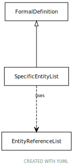

# Type: SpecificEntityList

A list of specific entity references that are to be included in the definition. When specified in this form,
the service must include all entities in this list whether they are known to the service or not, and whether
they are currently ACTIVE or not.

URI: [tccm:SpecificEntityList](https://hotecosystem.org/tccm/SpecificEntityList)

## Parents

 *  is_a: [FormalDefinition](FormalDefinition.md) - A value set definition choice

## Uses Mixins

 *  mixin: [EntityReferenceList](EntityReferenceList.md) - A collection (set) of zero or more entity references that belong to the same scoping namespace

## Attributes

### Mixed in from EntityReferenceList:

 * [EntityReferenceList➞entities](EntityReferenceList_entities.md)  0..*
    * Description: The entity references ("concept codes") in the list
    * range: [EntityReference](EntityReference.md)

### Mixed in from EntityReferenceList:

 * [EntityReferenceList➞namespaceName](EntityReferenceList_namespaceName.md)  OPT
    * Description: The local identifier assigned to this namespace
    * range: [CodeSystemName](types/CodeSystemName.md)

### Mixed in from EntityReferenceList:

 * [EntityReferenceList➞namespaceURI](EntityReferenceList_namespaceURI.md)  REQ
    * Description: The URI associated with the supplied namespace as determined by the author/service instance
    * range: [ExternalURI](types/ExternalURI.md)
