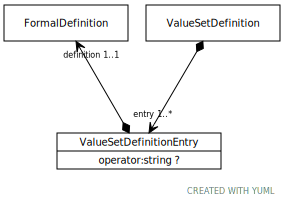

# Type: ValueSetDefinitionEntry

An element of a value set definition that, when resolved yields a set of entity references that are to be included
in, excluded from or intersected with the set of elements that represent the full resolution of the definition.

Note that only ACTIVE entity references are included. INACTIVE entity references may never be considered for
inclusion or exclusion in the resolution of a value set definition.

URI: [tccm:ValueSetDefinitionEntry](https://hotecosystem.org/tccm/ValueSetDefinitionEntry)

## Referenced by class

 *  **[ValueSetDefinition](ValueSetDefinition.md)** *[ValueSetDefinition➞entry](ValueSetDefinition_entry.md)*  1..*  **[ValueSetDefinitionEntry](ValueSetDefinitionEntry.md)**
 *  **None** *[entry](entry.md)*  1..*  **[ValueSetDefinitionEntry](ValueSetDefinitionEntry.md)**

## Attributes

### Own

 * [ValueSetDefinitionEntry➞exclude](ValueSetDefinitionEntry_exclude.md)  OPT
    * Description: Exclude the resolution of this definition in the valueset
    * range: [FormalDefinition](FormalDefinition.md)
 * [ValueSetDefinitionEntry➞include](ValueSetDefinitionEntry_include.md)  OPT
    * Description: Include the resolution of this definition in the valueset
    * range: [FormalDefinition](FormalDefinition.md)
 * [ValueSetDefinitionEntry➞intersect](ValueSetDefinitionEntry_intersect.md)  OPT
    * Description: Include only the elements that are common between this definition and the valueset to this point
    * range: [FormalDefinition](FormalDefinition.md)
